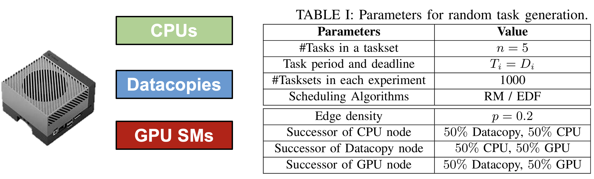
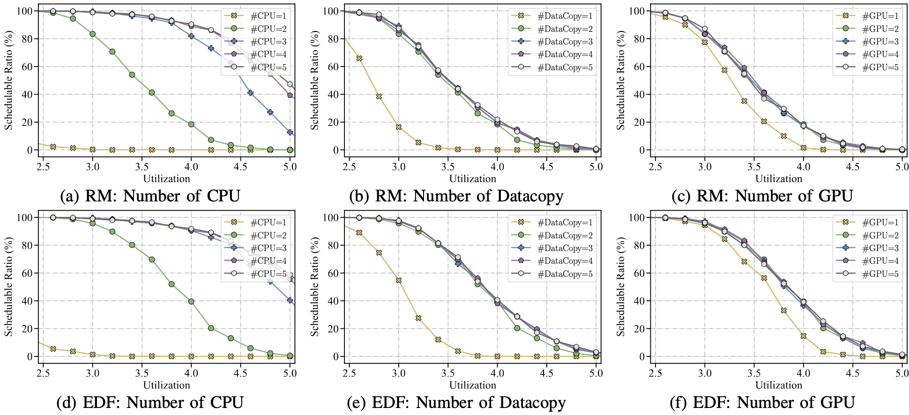

## Motivation

Agile benchmarking of scheduler performance and identifying dominant processors are critical for both processor architects and embedded software developers. Processor architects need to reveal the bottlenecks in terms of real-time schedulability and enhance architectural designs for future generations. Meanwhile, software developers need to test real-time scheduling strategies and optimize processor resource allocation efficiently. For instance, what are the minimal hardware resources required for a specific taskset to meet its deadlines? If the taskset cannot meet its deadlines, would adding CPU cores or integrating other accelerators be more effective? Since on-chip validation is often time-consuming and costly, our simulator provides a fast real-time verification tool for processor architects and software developers, allowing them to optimize computing platform designs or configurations to suit their tasksets.

We take the NVIDIA Jetson Serie's SoC as an example, which features multiple CPU cores, data copies, and GPUs. With our simulator, we can easily configure the hardware setting and scheduling strategies for pre-silicon tests. In this case study, we conduct extensive experiments to evaluate real-time scheduling on these architectures, focusing on the effectiveness of different scheduling algorithms and the benefits of increasing the number of processors with different types.



## Setup

To present schedulability under different configurations and scheduling strategies, we measured the schedulable ratio with respect to targeted utilization, which is defined as the number of schedulable tasksets divided by the number of tasksets. We apply the same method to generate utilization of $n$ tasks in existing works, and then we randomly generate all segment lengths, uniformly distributed within the range of 1 to 10. The deadline $D_{i}$ of task $i$ is set according to the generated segment lengths and its utilization rate. To form a DAG task, we set edge density $p$ representing the possibility of having dependency between two segments and adds edges if necessary to ensure connectivity. The default heterogeneous computing platform has 2 CPU cores, 2 parallel data copies, and 2 GPUs. The above table presents a detailed summary of task generation.

## Results

We first investigate the impact of the number of processor cores under the Rate Monotonic scheduling algorithm. The results are presented in figure (a)-(c), respectively. As the number of CPU cores, data copies, or GPU cores increases, the schedulable ratio increases correspondingly. However, the number of CPUs has a greater impact on schedulability than the other two processor cores. Compared to the case with only one CPU, the schedulable ratio doubles with one more CPU. 
A similar trend is exposed in figure (d)-(f), but the EDF scheduler performs better than the RM scheduler since EDF is a dynamically prioritized scheduler while RM sticks to fixed priorities. In those figures, the increments converge after $N_{CPU} \geq 4$, $N_{Copy} \geq 2$ or $N_{GPU}\geq 1$. Therefore, we can conclude that a suited proportion between CPU, data copy and GPU cores is 4:2:1, given the premise of similar workloads.




## Have a try?

The source codes are available under `app/benchmar`. we have provided two scheduler implementations `edf.py` and `ratemonotonic.py`.

To run the experiments in parallel:
```bash
python ./generate_commands.py > run.sh
bash ./run.sh
```

We recommend you use tmux so that the simulator can run in background persistently.
