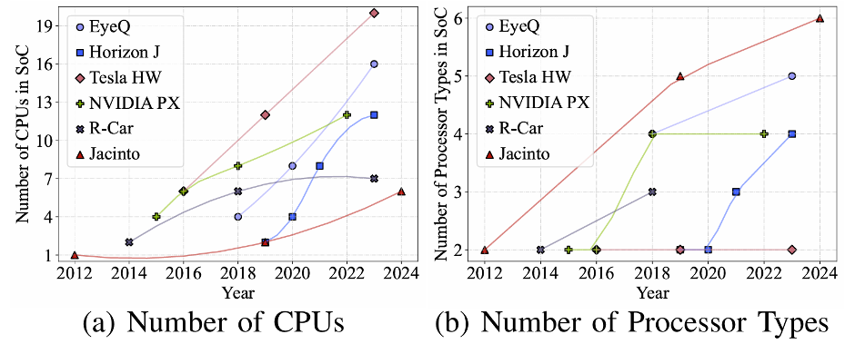

## Background 

The rapid evolution of artificial intelligence (AI) applications has driven the demand for more sophisticated and diverse computing architectures. Modern real-time AI applications increasingly embrace extreme heterogeneity, utilizing systems with varying processor types to meet performance demands. This trend is particularly evident in the development of automotive system-on-chips (SoCs) for autonomous systems, as shown in the following figure, where the number of CPUs and the diversity of processor types have increased significantly in recent years. As the number and variety of processors within a single SoC continue to expand, the challenge of accurately modeling and predicting system behavior becomes more and more critical.

Real-time AI applications, such as object detection, particle filtering, and audio recognition, often operate on a millisecond scale, where precise timing and responsiveness are crucial for the quality of services. Traditional offline analytics methods, however, often lead to pessimism and inaccuracy in estimating response times due to the growing complexity of these systems. This gap highlights the critical demand for more reliable and accurate tools and methods for predicting and evaluating timing performance for such systems.

Moreover, the non-trivial costs associated with real-time testing and validation---which require significant time, specialized skills, and facility resources---pose a substantial barrier to the efficient development and deployment of real-time applications on the heterogeneous system. To address these challenges, we propose a simulation approach and present a timing simulator (RTHeter) dedicated to exploring scheduling algorithms and evaluating the real-time performance on customizable architectures with ideal and practical processor models. This simulator aims to provide an agile and practical solution for understanding and optimizing the performance of complex real-time heterogeneous computing systems.

## Overview

We now present the simulating hierarchy for the real-time scheduling of heterogeneous computing platforms and the temporal simulation mechanisms. 

### Simulation Hieracrchy

The proposed RTHeter simulates the **processor core-level** scheduling and execution of multiple tasks on heterogeneous architectures. As shown in the below figure, it bridges the application tasks with the underlying hardware. RTHeter supports both ideal and practical hardware processor models. In the ideal model, microarchitecture-level dynamics, such as cache misses and branch prediction, are ignored. Therefore, a processor finishes the same amount of computational workload given a fixed time interval and RTHeter can work as a standalone simulator without the extra runtime dynamics inputs. In the practical model, these dynamics are abstracted into statistical parameters, causing the computation speed to vary but be bounded by the microarchitecture-level statistics. In the practical model, the RTHeter is plugged with the micro-architecture simulators, such as GEM5, GPGPUSim, and Aladdin, to obtain the microarchitecture-level statistical.

### Temporal Mechanisms

The execution of multiple tasks in heterogeneous architectures naturally follows a hierarchical structure, where the real-time scheduler schedules computation tasks at higher levels to lower-level processors. The proposed RTHeter sequentially divides this hierarchical process into continuous simulating slices. The slice is a simulation cycle (stride), which is the schedule granularity and its length can be configured from tick to any user-specific time unit. 

In each slice, RTHeter provides status of both the higher-level tasks and lower-level processors and renders an interactive interface for the median-level scheduler. RTHeter categorizes the hierarchical process into the following three activity groups, organizing them in temporal order to form a complete slice.

- **Step I:** Queries In these activities, the median-level scheduler inquires information without making any modifications. To make effective scheduling, it is necessary to check the status of both higher-level tasks ($\tau_1$, $\tau_2$, $\dots$),  and the lower-level processors ($p_1$, $p_2$, $\dots$). Therefore, our simulator supports querying each processor's status (busy or idle, preemptive or not, the current task executing, microarchitecture uncertainty, etc.) and the status of each task (period, deadline, execution progress, etc.).

- **Step II: Scheduling** This activity---which is the scheduling command from the median-level scheduler---comes with a 3-tuple parameter $(i,j,k)$, representing "schedule processor $i$ with task $j$ segment $k$". Our simulator first checks the validness of the command, blocking issues such as preceding segments being uncompleted, the processor and segment affinity not matching or the processor not supporting preemption. If the scheduling is valid, RTHeter binds the status variable of the lower-level processor with a given higher-level task. Since there are $N$ processors, there are at most $N$ scheduling commands in each slice.

- **Step III: Executions** All the lower-level processors advance one simulation cycle and update the status of lower-level processors and high-level tasks in these activities. In each time simulation cycle, the scheduler may skip scheduling some processors (for example when the processor is non-preemptive or reserves the computing power for future tasks), therefore it should invoke this function manually to indicate the finishing of scheduling. 

## Task Modeling

RTHeter supports one of the mainstream task models on heterogeneous architecture computing---the Direct Acyclic Graph (DAG) task model. In this model, each task $\tau_i$ is represented by a graph $G_i = (V_i, E_i)$, as well as its deadline $D_i$ and period $T_i$. Each vertex in $V_i$ corresponds to a subtask execution time and its processor affinity, while each directed edge represents the constraints that a subtask can only be executed after the completion of preceding nodes.

The multi-segment self-suspension model  is a special case of the DAG task model, where the only dependencies are linked between each segment (analogous to subtask in DAG). A task $\tau_i$ has ${m_{i}}$ execution segments and ${m_{i}-1}$ suspension segments between the execution segments. Thus, task $\tau_i$ with deadline $D_i$ and period $T_i$ is expressed as a 3-tuple:
$$
\tau_i = \big( (L_{i}^{1}, S_{i}^{1}, L_{i}^{2}, ..., S_{i}^{m_{i}-1}, L_{i}^{m_{i}}), D_{i}, T_{i} \big), 
$$
where $L_{i}^{j}$ and $S_{i}^{j}$ are the lengths of the $j+1$-th execution and suspension segments, respectively. 
From the CPU perspective, the execution segments $L_{i}^{j}$ are the computation segments, and the suspension segments $S_{i}^{j}$ are the workload offloaded to accelerators. In this work, we will stick to the term `segment` to represent the subordinate task regardless of the task model. 

## Functionality

To standardize the program interface and maintain the degree of extensibility, we implement every key component in C++ classes: `Segment`, `Task`, `Processor`, and `Simulator`. The figure below shows the layering and relationships between these classes in our simulator. On the very left, the `Simulator` is a class that works in a single instance incorporating the `Task` and `Processor` group in vectors. It mainly supports the four types of functions: 1) `query`, 2) `schedule`, and 3) `execute`, as described in the design section, as well as additional interfaces for the 4) creation and initialization of processors and task sets.

The class functions provided by `Simulator` will further invoke the underlying sub-function in the `Processor` or `Task` class. The figure below introduces the call stack of the three major functions. 1) `query` will invoke the `Task` checking, including the execution progress of tasks and whether the task is missing a deadline, etc. It also checks the processor status, such as idle or busy. 2) `schedule` will further bind (as a decisive command) the given segment with this processor, while improper scheduling behaviors are rejected automatically. 3) `execute` invokes the execute function of all the processors, which further invokes the update function of the task that binds to the processor in step 2. Of course, all the classes contain interfaces for initialization, which are called at the beginning of the simulation process.

## Key Components

The realization of external functions is founded on the construction of internal properties. Inside the implementation of `Processor` and `Task`, we classify the attributes into two categories: static attributes describing fixed properties and dynamic attributes representing runtime conditions. Those internal attributes are essential for the logical correctness of all the external functions. Following this design scheme, we implement them as follows:

### Processors
Each instance of a `Processor` simulates the runtime behavior of one processor core. A wide range of processors can be abstracted by two static attributes, its processor type (stored in enum) and whether supporting preemption (a boolean). We define two pointers as dynamic attributes to represent the working condition: `currentTask` and `currentSegment`. When the processor is scheduled with one task, these pointers change accordingly. Upon finishing the segment, two pointers are set back to null.

### Tasks

Each `Task` instance simulates the execution of a task $\tau_i$ in the taskset, matching the DAG task model. Further breakdown: An essential component is modeling the behavior of a `Segment`. For the static part, the `Segment` class uses initial length and processor affinity to describe a segment. The segment can be executed only if the type of processor matches with the segment.
For the dynamic part, we use one variable to model the task execution progress and a pointer pointing to the current processor. 

Treeifying the segments by dependencies forms a heterogeneous task $\tau_i$. We utilize the vector to store the instance of segments inside the `Task` class. In addition, two vectors depict the preceding and successive dependencies for each segment. When a segment is completed, our simulator visits all its consecutive segments in the list, checks whether their proceedings are all completed, and marks them ready.

## Building Up

One of the most critical components of the simulator is providing an easy-to-use but powerful user interface. The belowed figure shows the architecture for building schedulers in our simulator, which contains three layers: Simulator Libraries, Simulator Kernel, and User-definable Schedulers. At the bottom layer, the Simulator Libraries comprise all the necessary headers and libraries, deriving two functional building paths: (i) the Debug Mode (debugging program) and (ii) the Simulator Kernel (the simulator backend).

### Debug Mode 
In Debug Mode, we directly compile two additional source files---a taskset generator and a scheduler---with the simulator libraries into Executable 2. This program performs single-case simulations, which is essential for developers to make further changes to the simulator libraries, debug potential issues, and verify their implementations.

### Simulator Kernel
A full function path is compiling the library files with a tailored I/O handler (`interface.cpp`) into Executable 1. A corresponding Python frontend module in `client.py` encapsulates the simulator backend, by creating a subprocess and sending commands via pipe I/O. This module runs in a statically interactive manner in that it waits for the querying and scheduling from the upper-layer scheduler and returns the corresponding result or status.

**Excited? Navigate to [Getting Started](./installation.md) and try the tool!**