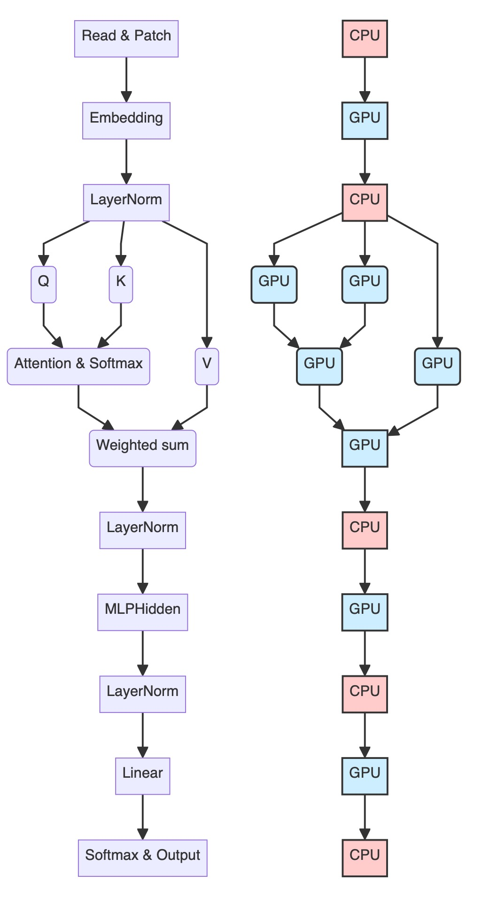
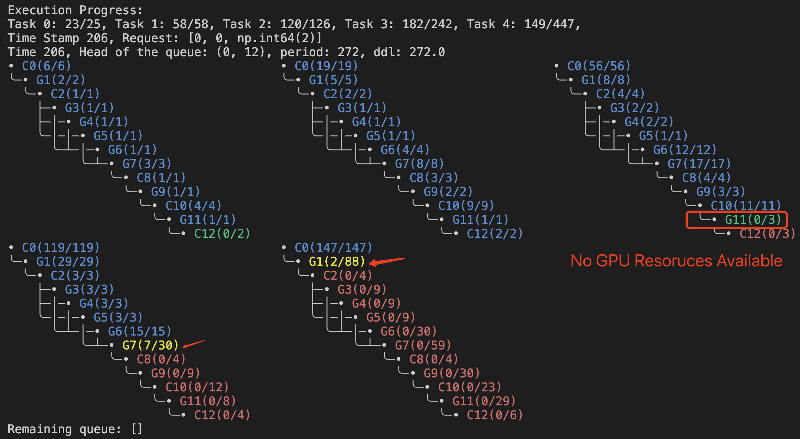

## Motivation

Researchers have been devoted to optimizing end-to-end real-time scheduling on heterogeneous architectures. [Xu et al.](https://ieeexplore.ieee.org/document/11015906/) introduce a scheduling algorithm and response time analysis for multi-core CPU-based heterogeneous architectures, failing to incorporate data copy overheads. [Saha et al.](https://ieeexplore.ieee.org/document/8864564)  introduce a software-hardware solution for efficient spatial-temporal scheduling for GPU, but the analytic pessimism is non-negligible. The existing methods are tailored to specific computing architectures and suffer from considerable analytic pessimism compared to real systems. However, our simulator is eligible to simulate general heterogeneous architectures and complex tasksets, upon which we can explore new-type schedulers. In this case study, we leverage RTHeter as a reinforcement learning environment and train a static real-time scheduling agent.

## Problem Formulation

The problem of finding a static scheduling policy for the agent can be formalized using the framework of Markov Decision Processes (MDPs). The MDP starts with an initial state $s_1$, representing the initial status of all processors and tasks, the current task ID, and the segment ID to schedule. By following a policy $\pi(a|s)=p(a|s)$, the agent takes action $a_1$ representing the targeted processor for scheduling, receives a reward $r_1$ evaluating the quality of the scheduling behavior, and then transfers to state $s_2$. This learning process will continue until all tasks are well scheduled or any task violates its deadline, generating a sequence of states, actions, and rewards: $[s_1, a_1, r_1; \dots; s_{T}, a_{T}, r_{T}]$, which is referred as an episode of length $T$. The agent updates the parameters $\theta$ of its policy $\pi_{\theta}(a|s)$ by policy gradient:

$$
\theta\leftarrow\theta+\alpha\sum_{k=1}^T\nabla_\theta\mathrm{log}\pi_\theta(s_k,a_k)\biggl(\sum_{k^{\prime}=k}^Tr_{k^{\prime}}\biggr),
$$
where $\alpha$ is the learning rate. % and $b_k$ is a baseline used to reduce the variance of the policy gradient.

As shown below, the action, reward, and state transitions are all supported by the RTHeter environment. We translate the agent action into `schedule` commands and encode the `query` results as state $s_i$. For the reward, three metrics returned from RTHeter evaluate the scheduling behavior: Does the agent decide to schedule or skip this round (`lazy`)? Is the scheduling legal or not (`legal`)? Does it cause preemption (`preemption`) or not? A linear combination of these metrics calculates the reward:


$$
R =  a \times \text{lazy} + b \times \text{legal} - c \times \text{preemption},
$$
where $a$, $b$, and $c$ are experimentally determined parameters.

## Synthetic Tasks

We train the agent under the hardware setting of 2 preemptive CPUs and 2 nonpreemptive GPUs with a fixed taskset consisting of 5 tasks under the self-suspension model and simulation time-bound is set to the least common multiple of all the tasks' periods. Hence, the action $a_k$ will be an integer ranging from 0 to 4, where 1 and 2 represent scheduling on CPU 1 and 2 respectively, 3 and 4 represent scheduling on GPU 1 or GPU 2, and 0 stands for skipping this round. The agent is implemented by a $64\times64$ ResNet block and multilayer perceptron (MLP) with 3 hidden layers, each including 48,32,16 neurons and rectified linear unit (ReLU) as activation function.

We now show the reward that our agent receives within the first million episodes, exhibiting a stair-like generally rising trend. Those stairs represent a critical time in the scheduling process, where a non-optimal choice may lead to a missed task deadline. Initially, the agent is likely to perform illegal scheduling, such as putting CPU segments ($C_i^j$ represents the $j+1$-th CPU segment of $\tau_i$) on GPU as shown in figure (c). After several episodes, the agent advances to "survive" more time stamps. In figure (d), the agent successfully handles the first release of $\tau_1$, but scheduling is still not feasible. From $t=13$ to $t=17$, since the only ready GPU tasks are $G_3^4$ and $G_5^2$, our agent schedules them on the two GPUs. Unfortunately, those two segments are long and the GPU is non-preemptive, thus $\tau_1$ has to wait until $t=18$ to access the GPU, causing a deadline violation. The global EDF scheduler also fails to schedule this taskset for the same reason.


After 1363K episodes, our scheduling agent successfully identified a feasible scheduling solution. Utilizing RTHeter, we finish the simulation and reinforcement learning within 20 hours on an i7-11700 processor with NVIDIA GTX 1660 Super. The training results are visualized below, you may open the figure in another tab to see details.


## ViT Tasks

Transformer-based neural networks have seen diverse applications in vision tasks and language models. The proposed RTHeter can also train a scheduling agent for transformer based workload.



We first implement 5 parllel ViT ranging from tiny to extreme larges, and profile their corresponding task lengthes. The baseline EDF scheduler cannot find feasible scheduling even at low utilization $u=1.5$, while our agent can survive.



## Have a try?

For the *synthetic tasks*, the source codes are available under `app/RL-synthetic`. we have provided a corresponding `environment.py` and a baseline scheduler `edf.py`.

You can first perform scheduling manually, feeling how challenging the problem is :(

```bash
python ./manual.py
```

To train the agent:
```bash
cd app/RL-synthetic
# torch is required
python ./train.py
```

You may obtain training log as `training_log.txt`.

For the *ViT tasks*, the source codes are available under `app/RL-ViT`. we have provided a corresponding `dagedf.py` and a baseline scheduler `dagedf.py`.

To see how the agent successfully survives:
```bash
python ./agent.py
```
