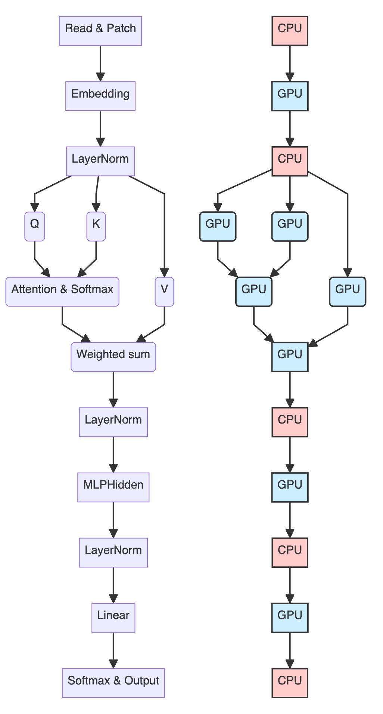
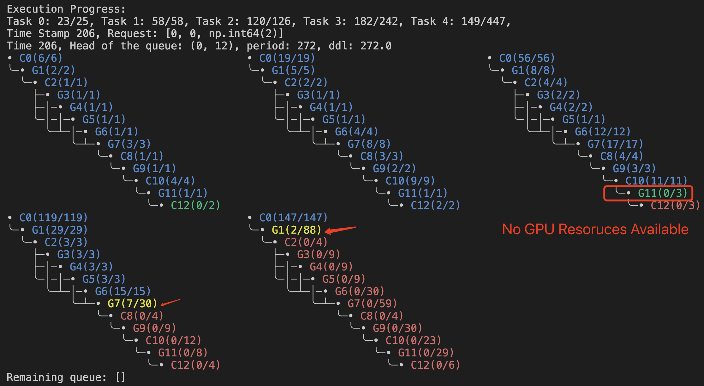

## Motivation

Transformer-based neural networks have seen diverse applications in vision tasks and language models. The proposed RTHeter can also train a scheduling agent for transformer based workload.



## Experimental Settings

We first implement 5 parllel ViT ranging from tiny to extreme larges, and profile their corresponding task lengthes. The baseline EDF scheduler cannot find feasible scheduling even at low utilization $u=1.5$, while our agent can survive. The key reasons are:

- EDF scheduler cannot reserve computing resources for the future;
- EDF scheduler does not know the real dependencies, as deadlines are calculated after typological sorting.



## Have a try?


For the *ViT tasks*, the source codes are available under `app/RL-ViT`. we have provided a corresponding `dagedf.py` and a baseline scheduler `dagedf.py`.

To see how the agent successfully survives:
```bash
python ./agent.py
```
